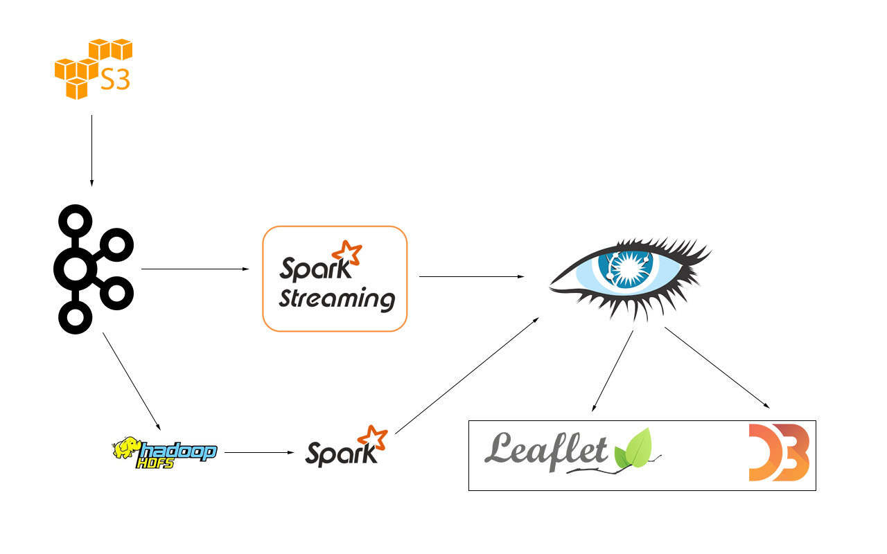

# Citizenisation

## Importance
As the prices of electronical components and sensors get cheaper over time, more and more IoT devices are popping up. An effective way to generate data on mass with these cheap devices is to incorporate citizen science. Citizen science projects can generate large volumes of data that require processing, since the computing processors on board the IoT devices are usually weak and cheap.

## Relevant Technologies
  - S3/HDFS
    - Storage of data source for streaming simulation and for batch processing.
  - Kafka
    - Ingestion of streaming sensor data.
  - Spark Streaming
    - Processing of data. Averaging last *x* datapoints.
  - Spark - *extension*
    - Process older data for trends.
  - Cassandra (?)
    - Storage of processed data.
  - Leaflet
    - Locality based visualisation.

### Proposed Pipeline

## Data Source
Sample citizen science data from radiation sensors can be obtained from [Safecast](https://blog.safecast.org/data/). Uncompressed, the `.csv` file is ~12 GB in size. This will be used as the seed data to bootstrap the required amounts.
